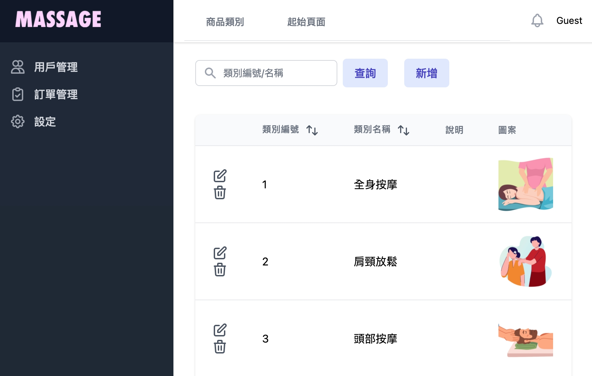
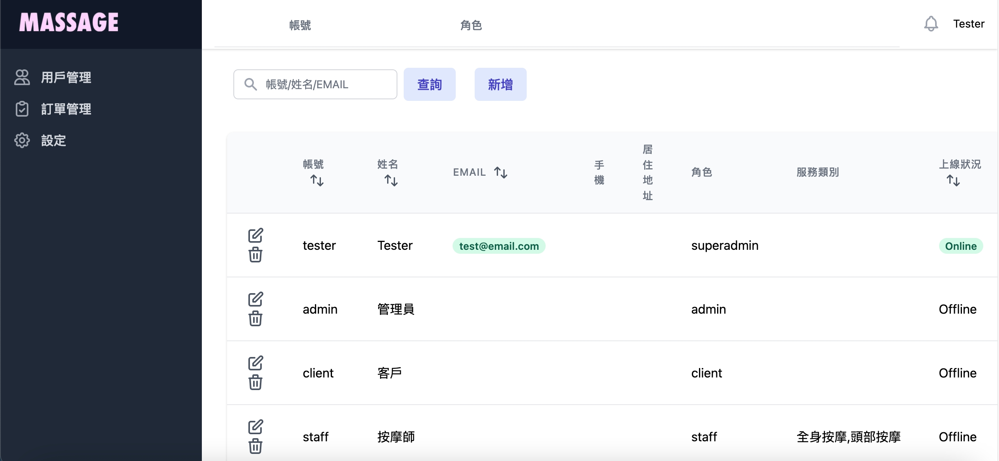
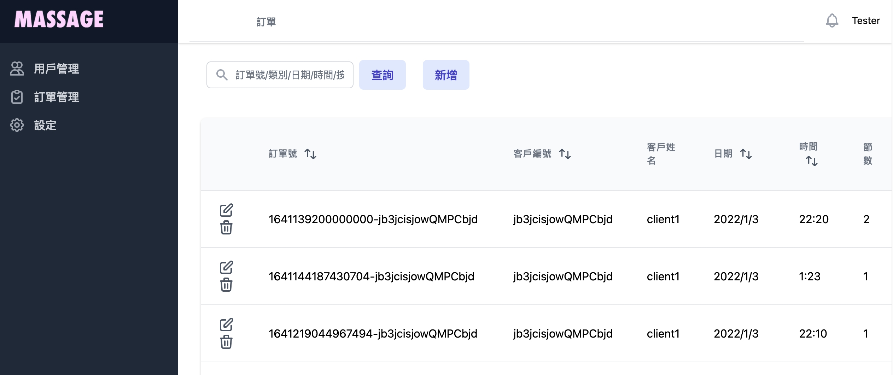

# Backstage

> ✨To Be Continued ✨

## About

這是一個以按摩服務為主題搭建的的後台系統，使用 meteor 框架，及運用React與tailwind CSS，能同時處理前後端，
並提供 API 讓他方做資料存取，此專案仍在進行中...




## 功能架構

-   登入/登出：登入後才能看到資訊
-   用戶管理
    -   帳號
        -   查詢
        -   新增/修改/刪除
    -   角色：綁定權限
        -   系統管理員
        -   管理員
        -   員工
        -   客戶
            -   查詢
            -   新增/修改/刪除
-   訂單
    -   查詢
    -   新增(暫時新增假資料，後續由外部送入訂單)
    -   修改/刪除
-   設定：前台的頁面設定
    -   商品類別
        -   新增
        -   修改
        -   刪除
    -   起始頁面
        -   新增
        -   修改
        -   刪除

## Getting Started

This app requires you to have Meteor installed on your machine.
Then you can clone the repo and run the following:

```
meteor npm install
```

```
meteor
```

## Deploy

暫時部署在免費的 Meteor Cloud 平台，載入時可能需要花費一點時間！
https://backstage.meteorapp.com/

訪客可使用此組帳號密碼做登入：
帳號：guest
密碼：guest123

## 參考資料：

https://atmospherejs.com/simple/rest
https://meteor-rest.readthedocs.io/en/latest/packages/rest-accounts-password/README/
https://enable-cors.org/server_meteor.html
